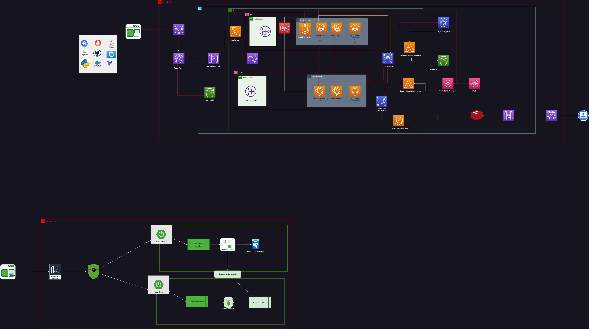

# Spaces Core Repository


### Design Architecture


### How to Setup Terraform and Docker Infras
````shell
docker compose up -d
````
To run the Localstack and Prometheus, Grafana

````shell
tflocal init

tflocal validate

tflocal plan -var-file=environments/dev/dev.tfvars

tflocal apply -auto-approve -var-file=environments/dev.tfvars

````
To run local the environment AWS and Observability integrations


Executing S3 Queries with localstack
````shell
aws --endpoint-url=http://localhost:4572 s3 ls

aws --endpoint-url=http://localhost:4566 s3 ls s3://logo-community-teste/uuid_path/
````
